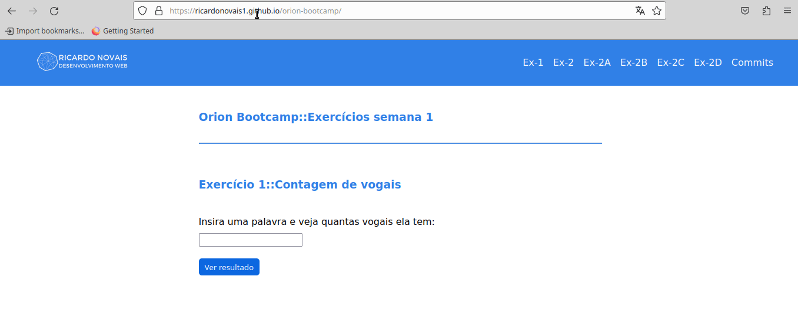

# ORION BOOTCAMP

Visite a página do exercício no GITHUB PAGES: https://ricardonovais1.github.io/orion-bootcamp/



## EXERCÍCIOS DA SEMANA 1:

### Para executar o projeto, execute

#### 1)

```git clone git@github.com:Ricardonovais1/orion-bootcamp.git```

#### 2)

```cd orion-bootcamp```

#### 3)

```npm install```

#### 4)

```npm start```

#### 5)

Acesse: http://localhost:5500

### Exercício 1 - Criar uma função que retorne a quantidade de vogais da palavra passada.

#### a) Dar exemplo de uso com uma palavra recebida via parâmetro de uma função:

Altere a variável chosenWord o retorno no console do navegador será atualizado ao recarregar a página.

#### b) Dar exemplo de uso com uma palavra recebida via input no formulário:

Abra http://localhost:5500, insira uma expressão no input e clique em 'Ver resultado'.

### Exercício 2 - Dado o array com dados de cientistas:

#### a) Crie uma função que retorne a bio do id passado

--> Criei a funcão getScientistBio, no arquivo exercicio-2.ts, que recebe a lista e um id como parâmetro.
--> Com base no ID fornecido é instanciado um cientista e retornada sua Bio.

#### b) Crie uma função que retorne o name do id passado

--> Criei a funcão getScientistName, no arquivo exercicio-2.ts, que recebe a lista e um id como parâmetro.
--> Com base no ID fornecido é instanciado um cientista e retornado seu nome.

#### c) Crie uma função que apague um item da lista a partir de um id passado

--> Criei a funcão gdeleteScientist, no arquivo exercicio-2.ts, que recebe a lista e um id como parâmetro.
--> Com base no ID fornecido é deletado um cientista e retornada lista atualizada.

#### d) Crie uma função que altere a bio ou o name a partir de um id passado

--> Criei a funcão deleteScientist, no arquivo exercicio-2.ts, que recebe a lista e um id como parâmetro.
--> Com base no ID fornecido é deletado um cientista e retornada lista atualizada.

#### e) Demonstre todas as funções com o paradigma funcional e com o imperativo

--> No arquivo exercicio-2-imperativo.ts criei a classe ScientistList, que possui todas as funções acima como métodos e seu construtor recebe a lista de cientistas como parâmetro.

